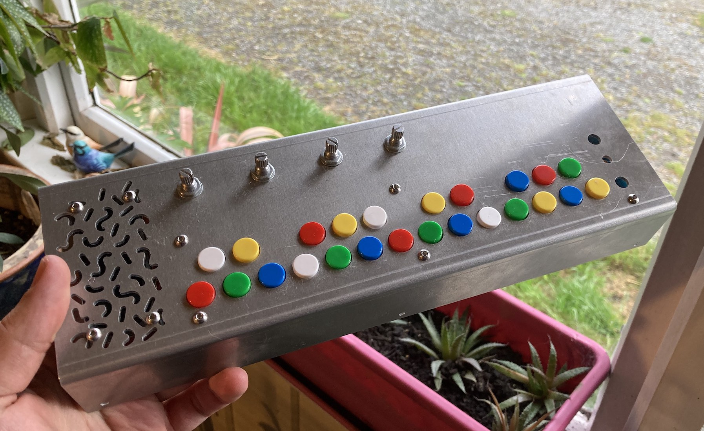
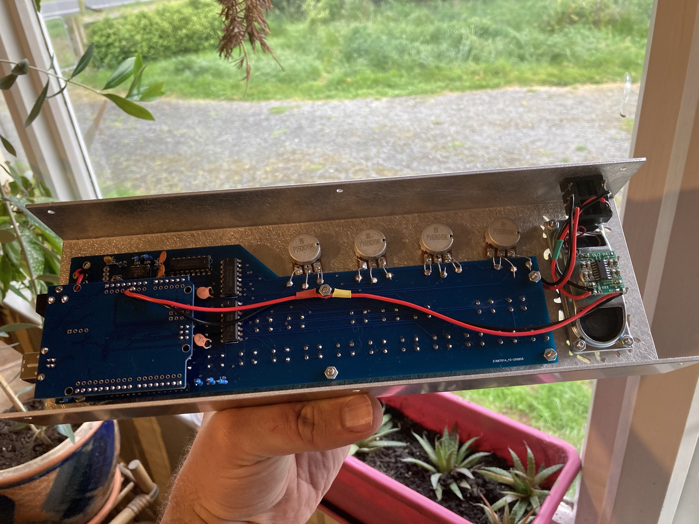
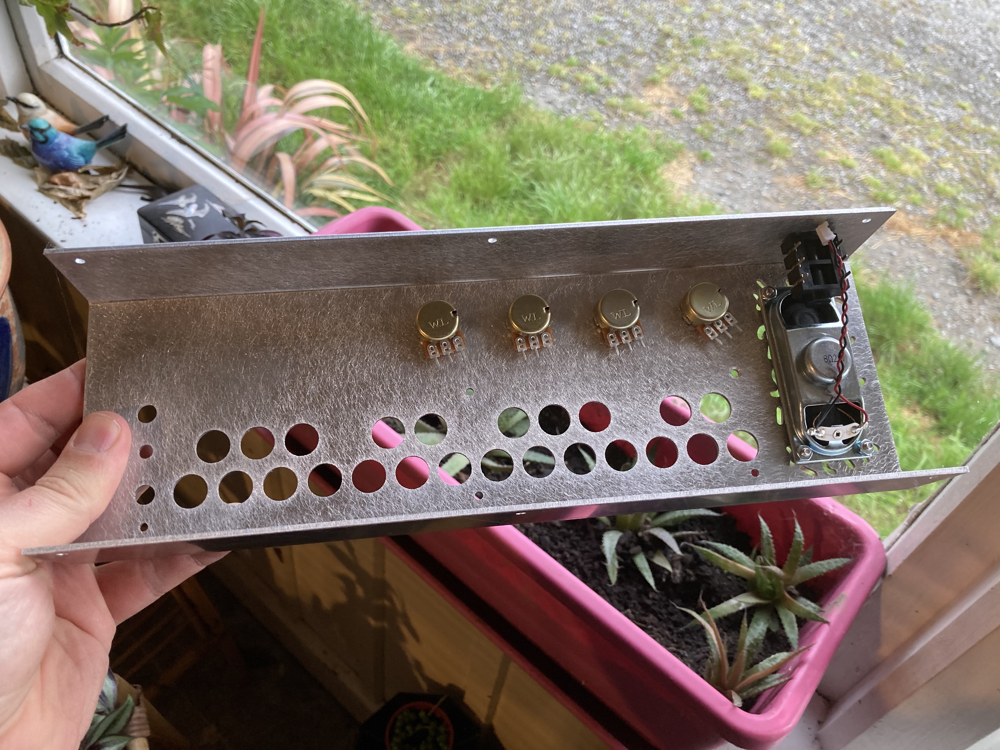
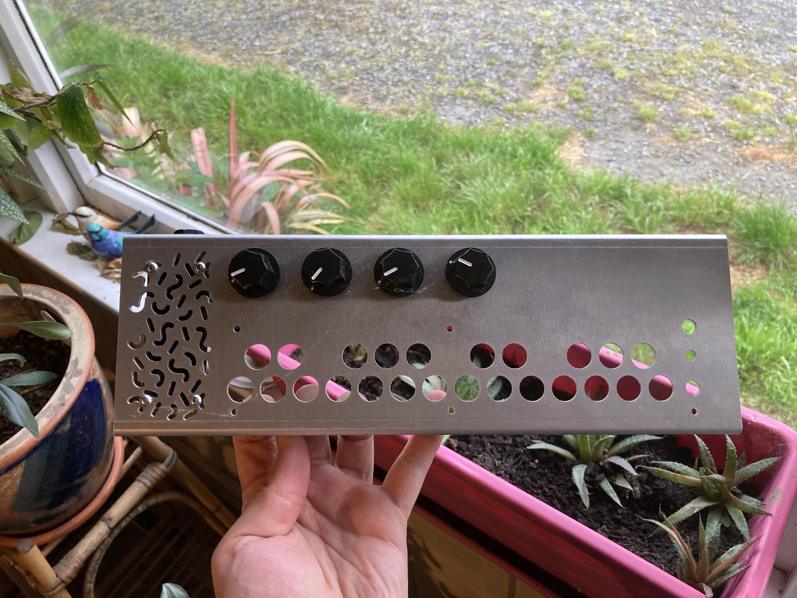

# Critter&Guitari - Arduino Piano Case

For ages I wanted a Critter & Guitari Pocket Piano, but the cool thing is they are now out of stock. <strong>BOOO!</strong> 
So during the COVID-19 lockdown in 2020 I started building my own one. The Critter & Guitari code I know is not their final version or is the final version for their kit but differs from their production model, THATS COOL THO! We will make this and see what happens.... 
 
I kinda hate the bare PCB thing, but understand why so many kits use it. So I decided to put together this case. It matches up with the PCB on the CG Github but there are some things that need to be considered:
<ol>
  <li> This is still a draft, components I ordered have been lost in the post and junk and I havent been able to source replacements yet. <em>(lazy)</em></li>
  <li> Theres a bit of space between the pots and the pcb. This means that you need to make a little bridge between them. I did this so that you can use different sized pots if you want but its a bit less stable as you arent using them as a mounting point to the case. But thats not a biggie if you get your spacers right. </li>
  <li> I designed a speaker grill that might not be to your liking. too bad! It uses a 70x30mm speaker. </li>
      <li> The CG pcb is designed to use those small momentary tact switches, I wanted bigger buttons though so the holes are big and the button caps dont really connect to the switch. I used some hot glue to fill up the gap in the cap so they have something to press against the button and make the switch click. I know this is hacky but whatever man. 
          <strong>NOTE:</strong> Critter & Guitari only supplied the gerbers so I couldnt easily adjust the footprint of the switches to fit bigger better ones that actually connect to the button caps. If anyone wants to do this thats great and send me a copy so I can get some new PCB's
   </li>
  <li> If you want to use a speaker you will also need to include an amp. </li>
  <li> I know there is some funny wiring and maybe you think the speaker is on the wrong side but the USB and power junk is on the other end. It would be cool to add a speaker connection to the other end of the board. But also gerbers, cant edit easy, blah. </li>
</ol>
 

<table style="border:0px;">
<tr>
  <td></td>
<td></td>
<td></td>
  </tr>
  </table>
 

I got two of the top cases built as prototypes out of 2mm aluminium. You can probably go a bit thinner but I wanted some *HEFT*. The machine shop mentioned there was an error in the speaker grill that did some funny things. I havent fixed this in the dxf file. I have also updated the illustrator file (I import this to Fusion360 as I suck at it) to balance things a bit as I didnt take the speaker into consideration very well haha.

 

Once I had sorted out the details with the top case I was going to build the bottom out of laser cut ply, to match the CG original, but this hasnt happened yet or might just be a early draft. 

 

If you end up using these files to build a case, I would love to see your work: brian.hainsworth@gmail.com

<h2>RESOURCES</H2>
<ul>
  <li> Critter & Guitari Arduino Piano Sketches - https://github.com/critterandguitari/Arduino-Piano-Example-Sketches </li>
  <li> Critter & Guitari Arduino Piano PCB - https://github.com/critterandguitari/Arduino-Piano-PCB</li>
  <li> Majoras-Other-Mask - Arduino Piano Code development - https://github.com/Majoras-Other-Mask/DIY-Pocket-Piano </li>
